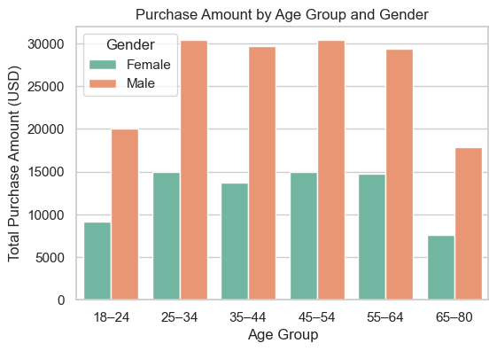
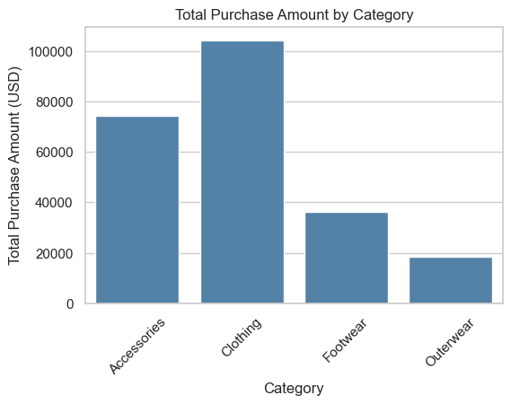
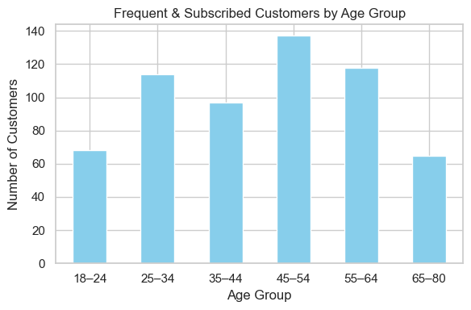
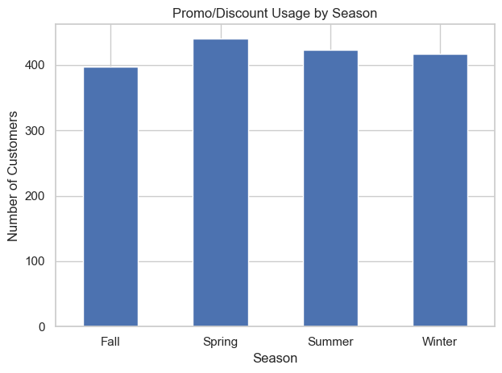
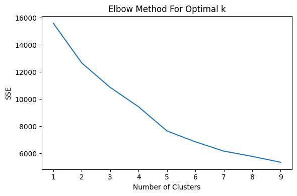
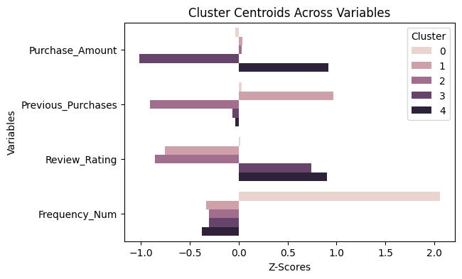
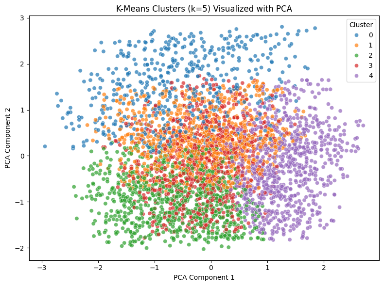

# Customer Segmentation Analysis

Customer Segmentation Analysis for an apparel store using Python

## Dataset
* Consumer Behavior and Shopping Habits Dataset from [Kaggle](https://www.kaggle.com/datasets/zeesolver/consumer-behavior-and-shopping-habits-dataset)

This dataset contains information about customers and their purchases for an apparel store. It includes demographics, purchase history, product preferences, and more. 

## Objectives
* Determine customer segments from purchase behavior

* Identify opportunities for targeted marketing strategies that drive revenue and growth

### Business Questions:

* What are the customer segments based on purchase behavior?

* What customers are currently driving the most revenue?

* Which customers purchase the most frequently?

* Which customers uses promotions or discounts the most?

* Are there customers we could likely convert to subsciption?

* What products and categories are most popular? 

* When is the best season to promote the business?

## Data Description

There was a total 3900 unique customers that made a purchase at this store.

The main variables of interest within the dataset were: 

* **Customer_ID:** A unique identifier assigned to each individual customer, facilitating tracking and analysis of their shopping behavior over time.

* **Age:** The age of the customer, providing demographic information for segmentation and targeted marketing strategies.

* **Gender:** The gender identification of the customer, a key demographic variable influencing product preferences and purchasing patterns.

* **Category:** The broad classification or group to which the purchased item belongs (e.g., clothing, electronics, groceries).

* **Purchase_Amount:** The monetary value of the transaction, denoted in United States Dollars (USD), indicates the cost of the purchased item(s).

* **Season:** The seasonal relevance of the purchased item (e.g., spring, summer, fall, winter), impacting inventory management and marketing strategies.

* **Review_Rating:** A numerical or qualitative assessment provided by the customer regarding their satisfaction with the purchased item.

* **Subscription_Status:** Indicates whether the customer has opted for a subscription service, offering insights into their level of loyalty and potential for recurring revenue.

* **Discount_Applied:** Indicates if any promotional discounts were applied to the purchase, shedding light on price sensitivity and promotion effectiveness.

* **Promo_Code_Used:** Notes whether a promotional code or coupon was utilized during the transaction, aiding in the evaluation of marketing campaign success.

* **Previous_Purchases:** Provides information on the number or frequency of prior purchases made by the customer, contributing to customer segmentation and retention strategies.

* **Frequency_of_Purchases:** Indicates how often the customer engages in purchasing activities, a critical metric for assessing customer loyalty and lifetime value.

The Frequency_of_Purchases column had some values that could be interchangeable -- such as'Bi-Weekly' and 'Fortnightly', and 'Every 3 Months': 'Quarterly' -- so I replaced them to be the same. 

## Exploratory Data Analysis
After data cleaning and prep, I chose to explore the data across demographics and purchase information that defined the customers as unique shoppers. 

The plot below shows purchase amounts by age and gender. The store seemed to be more popular among men overall, with a mean age of 44.

  

 

The clothing cateogry was also the most popular category among customers.

    

 

All 3900 customers seemed to have previously purchased at this store before, but only 1053 of them (27%) were subscribed, whom were all men.

* 55.92% of customers also purchased either weekly, fortnightly, or monthly -- but only 15.92% of the customers were also subscribed -- indicating that many of those who already purchase frequently could gain an advantage from becoming subscribed.

Given we found that only men are subscribed, and we could further see that those who purchase frequently and are subscribed were men between the ages of 45 - 54. 

    

* The 43% who also used promos and/or discounts for their purchase were also all men.

Finally I found the use of promos and/or discounts remained relatively consistent across all seasons, with use slightly higher in Spring

    

## K-Means Clustering for Customer Segmenatation
Customer segmenation was done based on purchase behavior with K-Means Clustering. 

Variables of interest for clustering were selected: 
* Purchase_Amount
* Previous_Purchases
* Review_Rating
* Frequency_Num

For frequency of purchases, the original categorical values were converted to numeric for the analysis 
    
    freq_map = {
        'Weekly': 4,
        'Fortnightly': 2,
        'Monthly': 1,
        'Quarterly': 1/3,
        'Annually': 1/12
    }

I found the optimal number of clusters (k = 5) using Elbow plot method shown below. 

    

After fitting into k-means with k = 5, I visualized the cluster centroids to better see the differences between the averages of the variables and the clusters.

    

I also performed Principal Component Analysis to reduce the variables for visualizing the overlaps of clusters. However, it only represented about 51% of variance.

    

After analysis of the each cluster, I determined these to be the general characteristics: 
* **Cluster 0**: Frequent Customer, Satisfied

    * Customer tends to purchase most frequently -- on a weekly basis

    * Spends the average amount for a visit

    * Relatively satisfied with their purchases

 

* **Cluster 1**: Returning Customer, Low Satisfaction

    * Customer has previously purchased the most

    * Spends the average amount for a visit

    * Tends to purchase less frequently on a monthly basis 

    * Has left lower review ratings

 

* **Cluster 2**: New Customer, Low Satisfaciton

    * Newer customer -- has not previously purchased as much

    * Spends the average amount for a visit

    * Has left lowest review ratings

 

* **Cluster 3**: Low Spender, Casual Satisfied Customer

    * Customer tends to spends least amount for a visit -- below the average

    * Has left higher review ratings -- very satisfied

 

* **Cluster 4**: High Value, Satisfied Customers

    * Spends highest amount on purchase

    * Slightly less frequent customers

    * Has left highest review ratings -- very satisfied

I then determined that clusters 1 and 2 could be combined their overlapping variables -- which were more significant to what defined them rather than the big difference in the number of previous purchases. All customers had previously purchased before and one may have purchased more than the other, but it seemed that their low satisfactions the products were more distinct in comparison to the other clusters.

## Summary of Insights & Recommendations

**Customer Segments**

Based on the analysis, the 4 segments that were determined for the store are:
* Frequent, Loyal Customer

    * Customer tends to purchase most frequently -- on a weekly basis

    * Spends the average amount for a visit

    * Relatively satisfied with their purchases

* Casual Customer, Low Satisfaction

    * Either new or returning customers

    * Spends the average amount for a visit

    * Tends to purchase occasionally

    * Has left lower review ratings

* Low Spender, Highly Satisfied Customer

    * Customer tends to spends least amount for a visit

    * Tends to purchase occasionally

    * Has left higher review ratings -- very satisfied

* High Value, Satisfied Customers

    * Spends highest amount on purchase

    * Slightly less frequent customers

    * Has left highest review ratings -- very satisfied

 

**Subscriptions and use of discounts and/or promos**

* Most customers are not currently subscribed and don't use discounts and/or promos in their purchase. (Only 27%)

    * Even within each cluster, most are **not** subscribed. Slightly less than half are using discounts and/or promos in their purchases.

    * Those subscribed, used a discount and/or promo were also all men.

 

### Recommendations

* High Value, Satisfied Customers currently bring the most revenue for the store. 

    * Provide access to limited-time products and early-access. 

* Most of the store's customers are casual shoppers, with a lower to mid-level range in satisfaction for their purchases. 

    * Encouraged use of subscription, as well as personalized discounts, promos or engagement could encourage retention
    
    * Determine reasons for lower satisfaction ratings -- shopping experience? customer experience? etc. 

* There is also a great opportunity for low spending, highly satisfied customers to have encouraged use of subscription -- for more promos & discounts, as they are likely looking to spend the least amount for a purchase. 

* For frequent and loyal customers, similar methods are recommended with more personalized promotions that are tailored to their preferences. 
    
    * Loyalty points could also be measured and rewarded, to leverage the existing strong customer relationship and drive growth.

*Seasonal*
* Most purchases happen in the Spring, and while use of promos and/or discounts remain relatively consistent across the different seasons, it may be effective to bring attention to them during this time of year. 

* The Fall season also generated the most revenue, so that might be another good time of the year to consider.